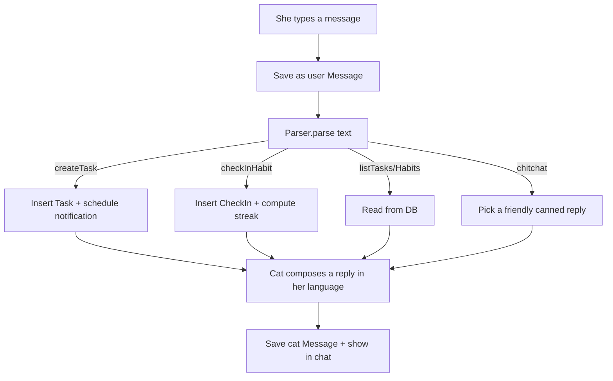

# 02 — Architecture

This is the blueprint: the stack, how the code is organized, the data we store, and how
the "smart" parts (understanding sentences, firing reminders) work.

## Tech stack

| Layer | Choice | Why |
|-------|--------|-----|
| Language | **TypeScript** | One language, with types to catch bugs early. |
| Framework | **Expo (React Native)** | Easiest path for a first mobile app; iOS now, Android later. |
| Navigation | **Expo Router** (file-based) | Screens = files; simple mental model, the modern default. |
| Local database | **expo-sqlite** | Reliable on-device storage for tasks/habits/check-ins. |
| Notifications | **expo-notifications** | Schedule the cat's reminders locally on the phone. |
| Date parsing | **chrono-node** | Understands "tomorrow 7am", and has Chinese support. |
| State | **React state + a small store (Zustand)** | Simple, beginner-friendly shared state. |
| **AI (core)** | **LLM via a tiny backend** (OpenAI default) | The brain for bilingual + casual understanding. |
| Backend | **One serverless function** (Vercel/Cloudflare) | Holds the API key so it's never in the app. |

> We will confirm exact versions when we install. The roadmap installs these gradually so
> each one is introduced when we actually need it (no big unexplained dump of packages).

## Folder structure (target)

```
cato-dupe/
├─ app/                  # Expo Router screens (each file = a route)
│  ├─ _layout.tsx        # Root layout: fonts, providers, navigation shell
│  ├─ (tabs)/            # The bottom tab bar lives here
│  │  ├─ _layout.tsx     # Defines the 3 tabs
│  │  ├─ index.tsx       # Chat (home tab)
│  │  ├─ tasks.tsx       # Tasks list
│  │  └─ habits.tsx      # Habits list
│  └─ settings.tsx       # Personalization (her name, cat name, language)
├─ src/
│  ├─ components/        # Reusable UI (ChatBubble, HabitRow, QuickReply…)
│  ├─ db/                # Database setup + queries
│  ├─ parser/            # The natural-language understanding layer
│  │  ├─ types.ts        # The Parser interface + result shape
│  │  ├─ llmParser.ts    # Primary brain: calls our backend (LLM)
│  │  ├─ ruleParser.ts   # Offline fallback: rules + chrono-node
│  │  ├─ dates.ts        # chrono-node date normalization (shared)
│  │  └─ index.ts        # Hybrid: pick LLM, fall back to rules
│  ├─ reminders/         # Scheduling + cancelling notifications
│  ├─ habits/            # Streak logic
│  ├─ persona/           # The cat's replies (bilingual copy)
│  └─ store/             # Shared app state (Zustand)
├─ assets/               # Images, the cat art, fonts, sounds
├─ server/               # Tiny serverless backend (holds the LLM API key)
│  └─ api/parse.ts       # POST text -> returns structured ParseResult JSON
└─ docs/                 # These docs
```

> **Why split `app/` and `src/`?** Expo Router treats every file in `app/` as a screen/route.
> We keep non-screen code (logic, components, helpers) in `src/` so routing stays clean.

## Data model

Five core "things" we store. Think of each as a table:

```
Task
  id            string
  title         string          # "pay the electric bill"
  dueAt         number | null    # timestamp the reminder is for
  type          'deadline' | 'fixedTime'
  notifyId      string | null    # the scheduled notification's id (so we can cancel)
  completedAt   number | null
  lang          'en' | 'zh'      # language she wrote it in (so the cat replies in kind)
  createdAt     number

Habit
  id            string
  name          string          # "reading", "看书"
  emoji         string          # 📖
  createdAt     number
  archivedAt    number | null

CheckIn                          # one row each time she completes a habit
  id            string
  habitId       string
  date          string          # 'YYYY-MM-DD' (one check-in per day)
  createdAt     number

Message                          # the chat history
  id            string
  role          'user' | 'cat'
  text          string
  createdAt     number

Settings (single row / key-value)
  herName, catName, preferredLanguage, theme, specialDates…
```

`Habit` + `CheckIn` together give us **streaks**: count consecutive days that have a
check-in. Keeping check-ins as their own rows (instead of a counter) means we can show a
calendar/heatmap later and never lose history.

## The Parser — how the cat "understands" sentences

This is the heart of Cato and the trickiest part, especially **bilingually**.

We define a single **interface** (a contract) so the rest of the app never cares *how*
understanding happens:

```ts
// what every parser must produce
type ParseResult =
  | { kind: 'createTask'; title: string; dueAt: number | null;
      type: 'deadline' | 'fixedTime'; lang: 'en' | 'zh' }
  | { kind: 'checkInHabit'; habitName: string; lang: 'en' | 'zh' }
  | { kind: 'createHabit'; name: string; lang: 'en' | 'zh' }
  | { kind: 'listHabits' | 'listTasks'; lang: 'en' | 'zh' }
  | { kind: 'chitchat'; lang: 'en' | 'zh' };

interface Parser {
  parse(input: string): Promise<ParseResult>;
}
```

Because everything depends on the **interface**, we can swap the implementation freely
without rewriting the app. That's the single most important architectural decision here.

> **Our chosen approach (see decisions D7/D8): LLM-hybrid.** The **LLM is the primary brain**
> for understanding intent + meaning (it's excellent at bilingual/casual/mixed input).
> **chrono-node** does the precise date math, and a **rule-based parser** is the **offline
> fallback** if there's no network. All three produce the same `ParseResult`.

### How the hybrid decides which path to use

```
input ──> is there internet?
            ├─ yes ──> LLM parser  ──(also normalize dates with chrono)──> ParseResult
            └─ no  ──> rule parser ──(chrono for dates)──────────────────> ParseResult
```

If the LLM call fails for any reason, we **fall back to the rule parser** so the cat always
responds with *something* useful rather than an error.

### The LLM parser (primary brain)

- The app sends the sentence to **our own backend** (never the provider directly).
- The backend calls the LLM with **function-calling**, instructing it to return the exact
  `ParseResult` shape (a strict JSON schema). This keeps the model's output structured and
  predictable instead of free text.
- The backend holds the **API key** as a secret env var, so the key is never shipped inside
  the app where it could be extracted.
- Default provider **OpenAI**, swappable to **Anthropic** in one place (D8).

```
App ──HTTPS──> /api/parse (our serverless fn) ──> OpenAI/Anthropic ──> JSON ParseResult ──> App
                         ^ holds the secret key
```

### The rule-based parser (offline fallback)

Steps the rule parser runs:
1. **Detect language** — does the text contain Chinese characters? → `zh`, else `en`.
2. **Detect intent** — match keywords:
   - check-in: `check in / done / 打卡 / 完成`
   - new habit: `track / new habit / 习惯`
   - list: `what / show / 有什么 / 看看`
   - otherwise → it's probably a task to create.
3. **Extract the date/time** — run `chrono-node` (English + Chinese locales) to find
   "tomorrow 7am" / "明天早上七点" and turn it into a real timestamp.
4. **Decide deadline vs fixed-time** — words like "by/before/截止/前" ⇒ deadline (nudge
   early); an explicit clock time ⇒ fixed-time (fire at that time).
5. **Clean the title** — strip the date words so the saved title reads naturally.

**Why keep a rule-based parser at all (when the LLM is the brain)?**
- It's the **offline safety net**: no network, or the LLM call fails ⇒ the cat still works.
- **Zero cost / private** for the cases it can handle (her text never leaves the phone).
- Building it first also teaches us the whole data flow with no servers/keys involved, then
  the LLM slots in behind the same interface.

**Its limits:** unusual or messy phrasing (especially mixed-language and casual Chinese) can
confuse it — which is exactly why the **LLM is primary** and this is only the fallback.

> **Bilingual reality check:** English date parsing is well-supported by chrono-node; Chinese
> relative dates (下周一, 大后天) are harder for pure rules. The **LLM handles bilingual and
> messy input ~95%+**, and chrono normalizes whatever date phrase comes back. The interface
> means swapping providers or tweaking the hybrid never touches the rest of the app.

## The Reminder engine

- When a task with a `dueAt` is created, we **schedule a local notification** via
  `expo-notifications` and store its `notifyId` on the task.
- `deadline` tasks get an **advance nudge** (e.g. a bit before due); `fixedTime` tasks fire
  **at** the time.
- The notification **content is the cat's voice** ("🐱 don't forget: pay the electric bill").
- If she completes or deletes a task, we **cancel** the scheduled notification by its id.

## The Habit engine

- Checking in inserts a `CheckIn` row for today (ignoring duplicates per day).
- **Streak** = walk backwards from today counting consecutive days with a check-in.
- The cat celebrates milestones ("🔥 3-day streak!").

## How a single message flows through the app



Everything funnels through the parser, then into the database, then back out as a warm
reply. Reminders later surface as notifications. That's the whole machine.
